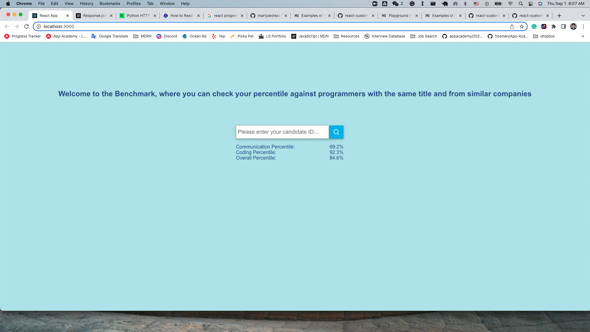
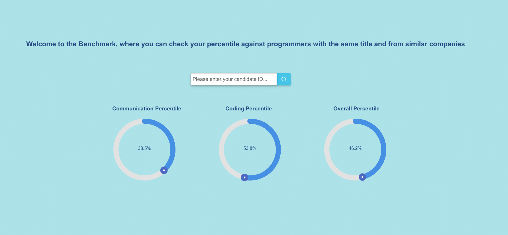

# Benchmark - Simple Fractal Coding Challenge

First of all, I would like to thank you for the opportunity of working on this coding challenge as I learned so much, including Python, Pandas, Flask, and adding React Charts. But, more importantly, I better understood how python + pandas can automate/optimize processes in various ways. I look forward to discussing this project more with you and hearing your suggestion to improve my codes.

## how to run the app (through Mac)

## In the flask-server folder, you can run:
* install pandas: `pip3 install pandas`
* install requests: `pip3 install requests`
* install scipy: `pip3 install scipy`
* activate server: `source venv/bin/activate`
* install flask: `pip3 install Flask`
* run backend server `python3 server.py`

## In the frontend folder, you can run: 
* install packages: `npm install`
* react-scripts start: `npm start`
* If not auto directed, go to `http://localhost:3000/`

## Reference & Credit:
* Python Pandas: `https://www.youtube.com/watch?v=vmEHCJofslg&list=PL9ACKgr0PKS90IjMAbLRnG90Qf68gU6M1&index=5`
* Flask + React Project Setup: `https://www.youtube.com/watch?v=7LNl2JlZKHA`
* Python and Flask - Routing and Variable Rules `https://www.youtube.com/watch?v=f085KDOy43k`
* Flask + React API call: `https://www.youtube.com/watch?v=06pWsB_hoD4&t=351s`
* React Chart: `https://github.com/martyan/react-customizable-progressbar`

## Data Visualization
### Before:

### After:

## Things to improve
*  Error handling
*  auto testing/debugging

## Percentile Formula (formula used here and through scipy library)
Percentile = n/N * 100% 
n = numbers of relevant scores less than or equal to candidate
N = total numbers of relevant scores 

For example, there are 11 scores: 

[1, 2, 3, 4, 5, 6, 7, 8, 9, 10, 11]

Percentile[1] = 1 / 11 * 100% = 9.1%

Percentile[6] = 6 / 11 * 100% = 54.5%

Percentile[11] = 11 / 11 * 100% = 100%

## Percentile Formula (alternative way of calculation, not available through scipy library)
Percentile = n/(N-1) * 100% 
n = numbers of relevant scores less than candidate
N = total numbers of relevant scores

For example, there are 11 scores: 

[1, 2, 3, 4, 5, 6, 7, 8, 9, 10, 11]

Percentile[1] = 0 / (11 -1) * 100% = 0%

Percentile[6] = 5 / (11 - 1) * 100% = 50%

Percentile[11] = 10 / (11 - 1) * 100% = 100%